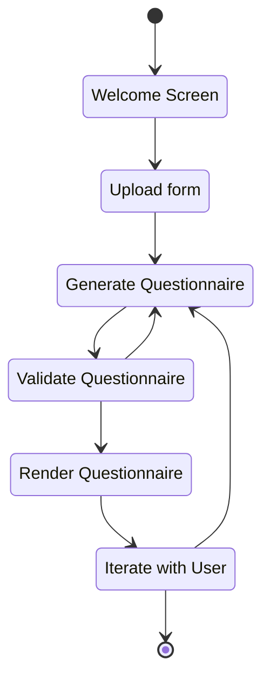
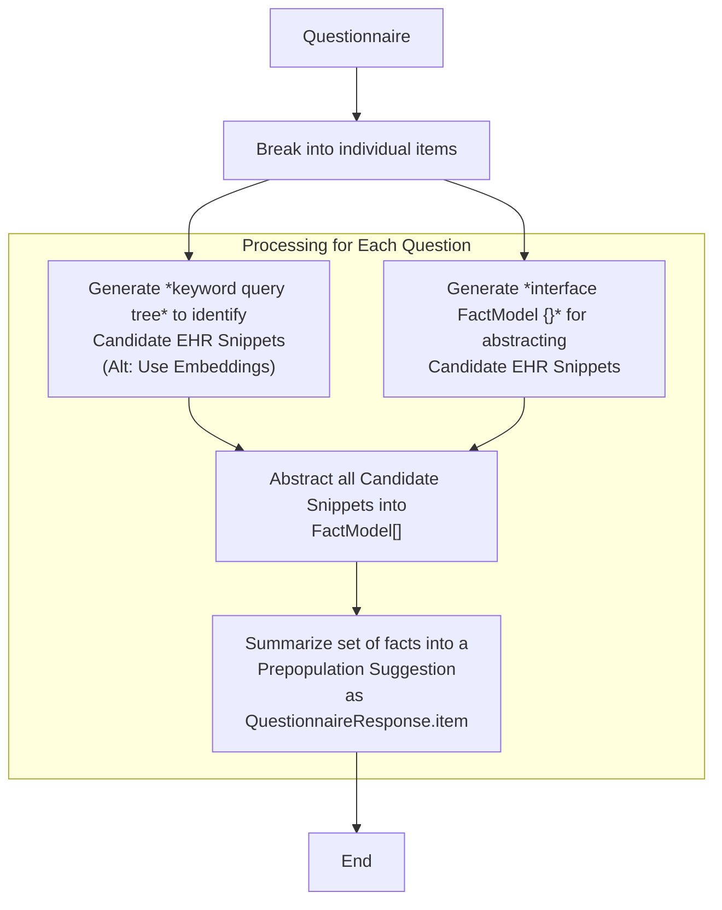

# Fun with Forms and LLMs

* Day 1: Creating FHIR Questionnaires from unstructured sources

* Day 2: Auto-populating items based on EHR data

* Day 3: UX for filling forms (with auto-population assistance)

# Themes

(In hackmd for editing.)

---

# Overview Video run-of-show

* Overview of "hack week" goals
  * https://github.com/microsoft-healthcare-madison/hackweek-2023-12
  * Learning + team-building exercise
  * Identify opportunities for healthcare standards 
  
* This week's topic: Clinical forms & structuring healthcare data
  * Day 1 / Day 2 / Day 3 goals
  * Build demos and build our own intuitions
  * We know full well these are each deep problems that we could get lost in
  * Try to keep moving forward and learning; catalog problems and set aside
  
* Day 1: Structuring free-text data into FHIR Questionnaires
  * Demo: a clinical instrument that has never been "LOINC-ified" (http://www.tbi-impact.org/cde/mod_templates/12_F_06_Rivermead.pdf)
  * https://github.com/microsoft-healthcare-madison/hackweek-2023-12/tree/main/day-1-fhir-questionnaire-creation/examples
  * Key theme: Lots of forms go through a formal standards process with, e.g. LOINC (~100K concepts and growing)... but Still there's a very long tail of clinical content
    * Specific disease areas / clinical research
    * Bespoke intake forms and local processes
  * Key theme: With in-context schema documentation, zero-shot generation is impressive
  * Key theme: Closed loop with FHIR validator improves output quality in complex cases
    * Better quality validation --> Better results
    * Better, clearer error messages --> Better results (Bonus: good for humans too)
  * Key theme: Iterating on large forms leads to the output from the model generalizing or produces snippits making it hard to code/edit - need to reduce scope and be more explicit with defining changes
  * Key theme: Need to QA results - hallucinations can be subtle (e.g., inventing questions instead of reading text)
      * Can be developer's fault (e.g., not providing enough context)
      * Can be system's fault (e.g., request failure results in explicit "I'll make this up")
      * Output includes only a "snippet" or theme for the change e.g. "... apply same to other questions..."
  * Gino: LOINC Coding Experiments
  
* Day 2: Automatically gathering and populating data from EHR
  * Demo: Unstructured data with cancer staging &
          Guided approach with "map/reduce"  and GPT-4 API
    * https://github.com/microsoft-healthcare-madison/hackweek-2023-12/blob/main/day-2-answer-suggestion/outputs/provide-all-details-needed-to-determine-the-breast-cancer-stage.md
    * Key theme: realistic data is hard to come by, for this kind of exploration
      * We can at least build intuitions using synthetic data
      * Example generation session: https://chat.openai.com/share/8f989aa9-d743-472f-b87e-a9709aeba4a2
    * Key theme: provide meta-structure, but give LLM the freedom to self-prompt
  * Demo: Structured data: Code Interpreter with full data set loaded locally
    * https://chat.openai.com/share/f3115614-7c1c-4f99-9907-0770201d3936
    * Key theme: resiliency + self-correcting behavior with feedback from code outputs
    * Key theme: self-guided analysis is hard; can take several attempts
    
* Day 3:  Brian screenshare on entering / pre-populating responses, pulling from existing content
  * SDC prepop if editors write expressions ahed of time
  * Could produce these extensions automatically

# Retrospective & Lessons Learned

## Josh

* UX Paradigms for interacting with LLMs are still being invented
  * We explore some structured and unstructured examples
* Getting the best out of your LLM
  * GPT-4 has strong built-in capabilities
  * GPT-4 samples at T=.7-1 have tremendous variability
  * *Taming the variability* without stifling the creativity
    * In-context guidance through detailed prompting is table stakes
    * In-context learning (e.g., with FHIR schema) helps steer generation tasks
    * External feedback loops (e.g., with FHIR validator or code interpreter) can be magical
    * "Narrow tasks" are helpful
      * Give LLM a specific, narrow task when "creative" or "insightful" work is involved
      * Use structured approaches to prevent errors downstream
        * e.g., gating application of changes with a human-facing decision
        * e.g., working out implications in a structured way, rather than asking the LLM
* Real/realistic are hard to come by
  * Critical for testing and intuition-building
  * Critical for evaluating a model's performance
  * Synthetic clinical notes can be very pragmatic... maybe for both

## Brian

* Also found that the approach using the typescript "interface" style of interacting worked VERY well.
* getting lists from the LLM wasn't obvious, though simple in the end, just including an array of objects in the interface
* The code comments on the interface actually worked very well as part of the prompt without other instructions.
* When receiving large questionnaires with fields that are similar can have trouble evaluating the difference between them. Further research required here.
    * It wasn't able to split the difference between Full name, title, preferred name. However it was able to chunk out given, middle and family names.
    * The inclusion of confidence, reasoning and source do help inform UI after response from AI to better post process for display.
* Getting the LLM to try and summarize a forms purpose with limited information really goes to show that poor form design can lead to more challenging use - which I guess is consistent with real usage.
    * Maybe an area that could be investigated further is continuing to review/refine a definition to improve usability/clarity.
* Using the LLM as a closed box and just sending it everything can be difficult to understand why something isn't working
* Breaking up process into smaller tasks and processing that way helps reduce unknown failures, and with smaller token count requests appear to be faster too.
* Breaking up questionnaires and providing subsets will be common, and may need multiple calls when trying to process a form
    * investigated a few approaches to dicing large form definitions with many groups/questions.
    * Approach ended up with was to chain through groups together, but also include the chain from the base of the questionnaire.
* As a UX experience, just blasting the result into the form without confirmation wasn't great, and particularly without the ability to discuss where it came from.
* UX Feedback that AI is still processing is important as it can take quite some time and what it is working on.
    * More important when doing multiple steps, as need to know which steps are taking the time.
* More open source SDC based tooling to help work with FHIR Questionnaires can be improved.
* When generating the form definitions, often the engine would give "snippits" that had do same here embedded which then needed to be split out again - makes processing into a real form via code difficult, and keeping a large form in context can be challenging/slow.
* Quality of error messages from validator can greatly improve the chances that GPT will correct things properly.

## Gino

* gpt-4 feels less like an 'expert' and more like a 'junior/senior pretending to be an expert'.
    * It *can* do a lot of things.
    * When right, it feels like magic.
        * Extracting the questions from the PRAPARE-English PDF file.
        * Selecting correct LOINC code based on a related-text query
    * When wrong, it can be extremely blatant or very subtle.
        * Extracting *most* of the questions of PRAPARE, but making up the last five.
        * Inventing a new LOINC code
        * Using an existing LOINC code, but inventing a new description.
    * **All** output needs to be verified and validated.
* gpt-4 performance and cost means that it is best to lean on AI for isolated and well-defined tasks instead of entire worfklows
* Testing is time-consuming and time-sensitive (contamination problem)
    * It is hard to know if your test is something it knows specifically (e.g., seen that brainteaser before)
    * Publishing test scenarios properly means that data could be included in a future set of models.
    * Care should be taken to ensure that tests are novel.

Rough ideas for *current* appropriate uses:
* Developer assistant
    * Models are good at writing code, somewhere between 80% and 100% correct.
    * Developer (in theory) has expertise to evaluate and fix.
* Concept derivation
    * Distilling free-form text into concise language from a particular context.
* Concept explanation
    * Expounding on a terse description (iteratively) with a user to achieve understanding.
* Visual data extraction
    * Great at pulling data, but *needs* visual comparison/review to ensure correctness.
* And feedback looping
    * Makes a good sounding board, even when results are incorrect.
* Overall
    * Processes that tolerate/integrate non-determinisim and fuzziness.
