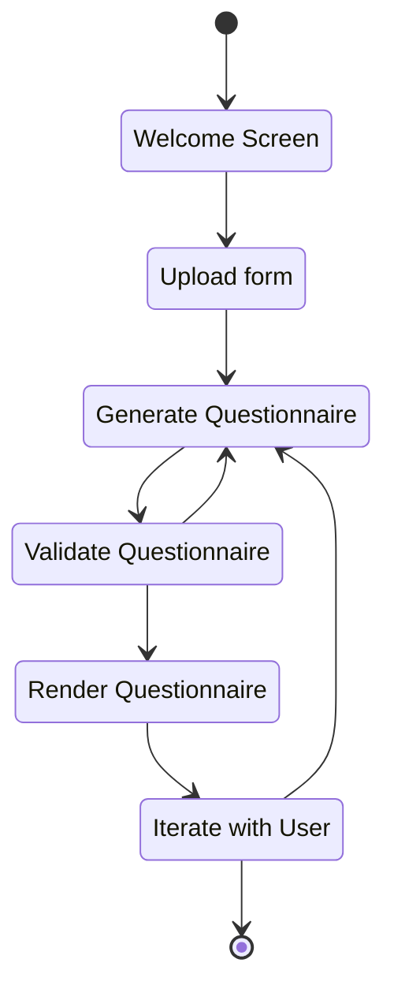

# Fun with Forms and LLMs

* Day 1: Creating FHIR Questionnaires from unstructured sources

* Day 2: Auto-populating items based on EHR data

* Day 3: UX for filling forms (with auto-population assistance)
