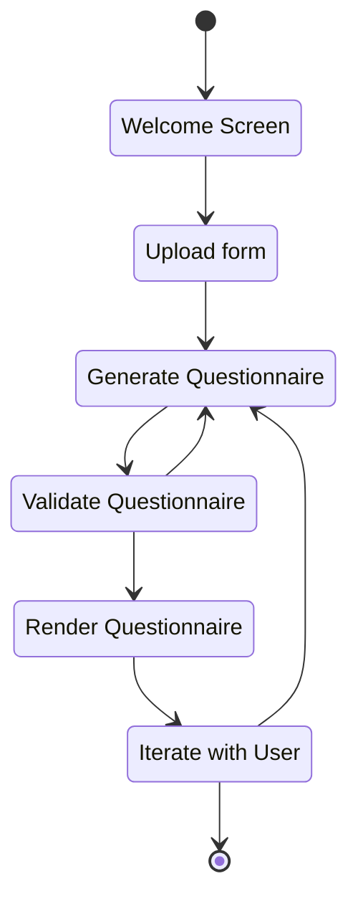
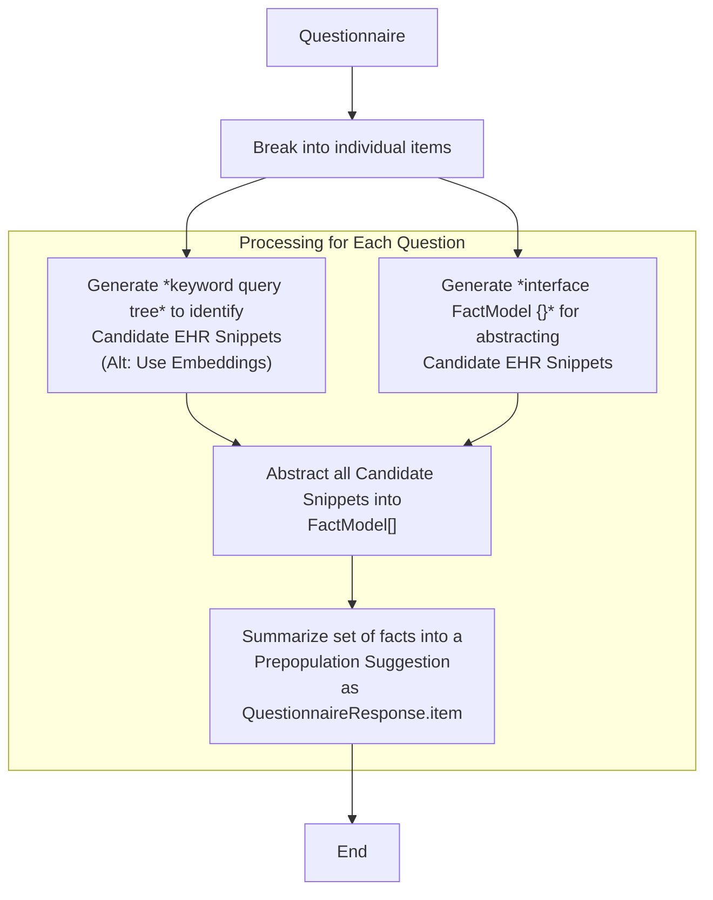

# Fun with Forms and LLMs

* Day 1: Creating FHIR Questionnaires from unstructured sources





* Day 2: Auto-populating items based on EHR data



* Day 3: UX for filling forms (with auto-population assistance)

# Themes

(In hackmd for editing.)

---

# Discovered issues / open problems

* Processing of form text is often cut off with comments like "// additional items in same format".
  
* some changes should require multiple patches to be applied - like when changing a `linkId` it should also change usage of the linkId elsewhere, including `enableWhen` expressions. 

```
Ambiguous Language
Clarify 'patname' to 'patientName' for readability and understanding in extensions
ApplyIgnore
[{"op":"replace","path":"/extension/0/valueExpression/name","value":"patientName"}]
```

# Side Quests

* Getting models to pick the best LOINC codes. Previous work used function calling -- but Code Interpreter provides an even tighter feedback look. [Example Transcript](https://chat.openai.com/share/6040b73f-e46d-4440-a15b-89a96e210f30)
* migrate the questionnaire helper code into the SDC npm package for others to use.
